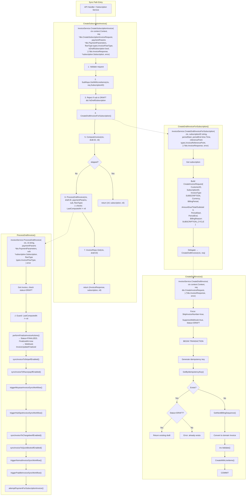
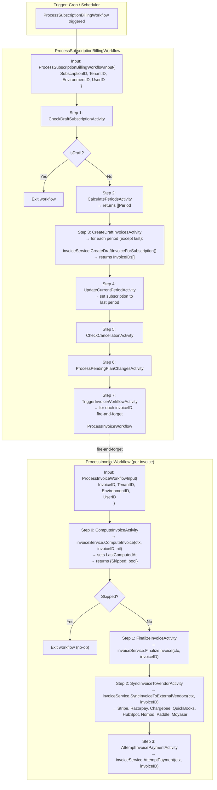
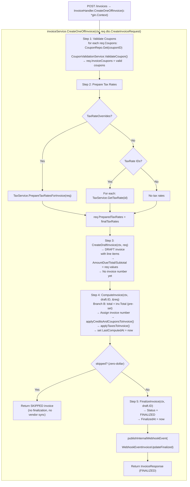
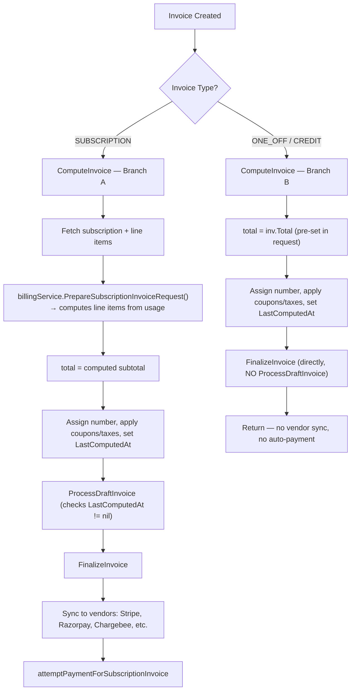
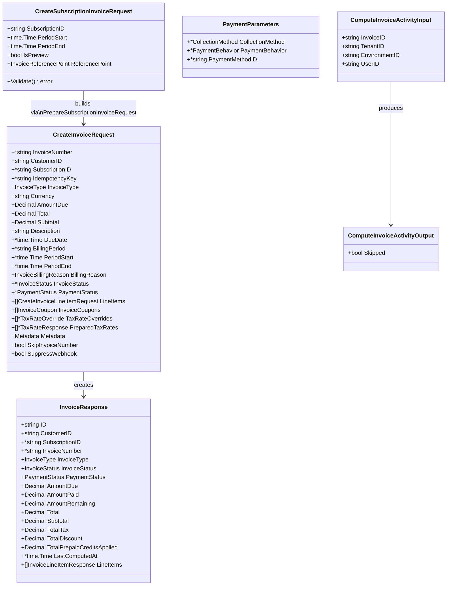
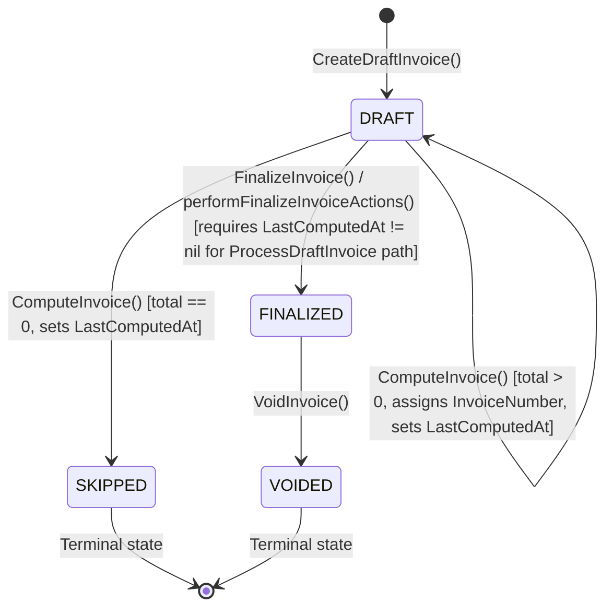

# Invoice Generation Flow

This document describes the invoice generation flow in Flexprice, covering subscription invoices (sync + async paths), one-off/credit invoices, the `ComputeInvoice` internal flow, and the invoice status lifecycle.

---

## 1. Subscription Invoice — Sync Path

The synchronous path used when creating a subscription invoice via `CreateSubscriptionInvoice`.

---

## 2. Subscription Invoice — Async Path (Temporal Workflows)

The asynchronous path used for periodic billing via Temporal.

---

## 3. ComputeInvoice — Detailed Internal Flow

Shows both Branch A (subscription) and Branch B (one-off/credit) with the `LastComputedAt` timestamp.

```mermaid
flowchart TB
    START["ComputeInvoice(
        ctx context.Context,
        invoiceID string,
        req *dto.CreateInvoiceRequest,
    ) (skipped bool, err error)"]

    TX["BEGIN TRANSACTION"]
    LOCK["InvoiceRepo.GetForUpdate(txCtx, invoiceID)
    → SELECT ... FOR UPDATE (row lock)"]

    IDEMP_CHECK{"inv.InvoiceNumber != nil
    OR inv.InvoiceStatus != DRAFT?"}
    IDEMP_RET["Return early (idempotent)
    skipped = (status == SKIPPED)"]

    TYPE_CHECK{"inv.InvoiceType ==
    SUBSCRIPTION?"}

    subgraph SUB_BRANCH["Branch A: Subscription Invoice"]
        direction TB
        SUB_GET["SubRepo.GetWithLineItems(txCtx, *inv.SubscriptionID)"]
        SUB_REF["Determine referencePoint:
        PRORATION → ReferencePointCancel
        else → ReferencePointPeriodEnd"]
        SUB_BILLING["billingService.PrepareSubscriptionInvoiceRequest(
            txCtx, sub, *inv.PeriodStart, *inv.PeriodEnd, refPoint,
        ) → *dto.CreateInvoiceRequest with computed line items"]
        SUB_TOTAL["total = applyReq.Subtotal"]
        SUB_REMOVE["Remove existing line items"]
        SUB_ADD["Add new computed line items"]
        SUB_UPDATE["Update: Subtotal, Total, AmountDue,
        AmountRemaining, Description, DueDate"]

        SUB_GET --> SUB_REF --> SUB_BILLING --> SUB_TOTAL --> SUB_REMOVE --> SUB_ADD --> SUB_UPDATE
    end

    subgraph ONEOFF_BRANCH["Branch B: One-Off / Credit Invoice"]
        direction TB
        ONEOFF_TOTAL["total = inv.Total (pre-set at draft creation)"]
        ONEOFF_REQ["applyReq = req (caller-provided coupons/taxes)"]
        ONEOFF_TOTAL --> ONEOFF_REQ
    end

    ZERO_CHECK{"total.IsZero()?"}

    subgraph SKIP_FLOW["Zero-Dollar → SKIPPED"]
        direction TB
        SKIP_COMPUTED["inv.LastComputedAt = now"]
        SKIP_STATUS["inv.InvoiceStatus = SKIPPED"]
        SKIP_UPDATE["InvoiceRepo.Update(txCtx, inv)"]
        SKIP_RET["Return (skipped=true, nil)"]
        SKIP_COMPUTED --> SKIP_STATUS --> SKIP_UPDATE --> SKIP_RET
    end

    subgraph ASSIGN_FLOW["Non-Zero → Assign Number & Apply Adjustments"]
        direction TB
        GET_NUMBER["GetNextInvoiceNumber(txCtx, &invoiceConfig)
        → e.g. INV-202501-00001"]
        SET_NUMBER["inv.InvoiceNumber = &invoiceNumber"]

        APPLY_CHECK{"applyReq != nil?"}

        CREDITS["applyCreditsAndCouponsToInvoice(txCtx, inv, *applyReq)
        → Coupons: TotalDiscount
        → Credits: TotalPrepaidCreditsApplied
        → Total = Subtotal - Discount - Credits"]

        TAXES["applyTaxesToInvoice(txCtx, inv, *applyReq)
        → TotalTax
        → Total = Subtotal - Discount - Credits + Tax"]

        SET_COMPUTED["inv.LastComputedAt = now"]
        FINAL_UPDATE["InvoiceRepo.Update(txCtx, inv)"]

        GET_NUMBER --> SET_NUMBER --> APPLY_CHECK
        APPLY_CHECK -->|Yes| CREDITS --> TAXES --> SET_COMPUTED --> FINAL_UPDATE
        APPLY_CHECK -->|No| SET_COMPUTED --> FINAL_UPDATE
    end

    COMMIT["COMMIT TRANSACTION"]
    RET["Return (skipped=false, nil)"]

    START --> TX --> LOCK --> IDEMP_CHECK
    IDEMP_CHECK -->|Yes| IDEMP_RET
    IDEMP_CHECK -->|No| TYPE_CHECK
    TYPE_CHECK -->|Subscription| SUB_GET
    TYPE_CHECK -->|One-Off/Credit| ONEOFF_TOTAL
    SUB_UPDATE --> ZERO_CHECK
    ONEOFF_REQ --> ZERO_CHECK
    ZERO_CHECK -->|Yes| SKIP_COMPUTED
    ZERO_CHECK -->|No| GET_NUMBER
    FINAL_UPDATE --> COMMIT --> RET
```

---

## 4. One-Off / Credit Invoice Flow

The `CreateOneOffInvoice` entry point for creating one-off and credit invoices.

### Key Differences: One-Off/Credit vs Subscription

| Aspect | ONE_OFF / CREDIT | SUBSCRIPTION |
|--------|-----------------|--------------|
| Total source | Pre-set in request | Computed from subscription usage |
| ComputeInvoice branch | Branch B (uses `inv.Total`) | Branch A (calls `PrepareSubscriptionInvoiceRequest`) |
| Coupons/Taxes | From request (`PreparedTaxRates`, `InvoiceCoupons`) | From billing service |
| After compute | `FinalizeInvoice()` directly | `ProcessDraftInvoice()` (finalize + sync + payment) |
| Vendor sync | None | Stripe, Razorpay, Chargebee, QuickBooks, etc. |
| Auto-payment | None | `attemptPaymentForSubscriptionInvoice()` |
| Negative amounts | CREDIT type allows negative `AmountDue` | Not applicable |

---

## 5. OneOff vs Subscription — Comparison

---

## 6. Key DTO Structs

---

## 7. Invoice Status Lifecycle

