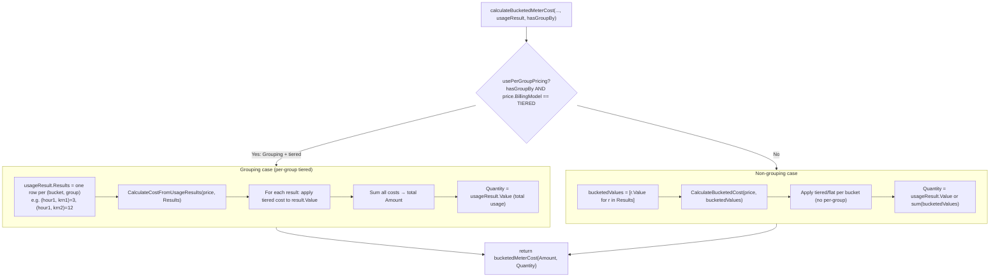

# Bucketed Meter Cost: Grouping vs Non-Grouping Flow

This document describes how cost is calculated for **bucketed meters** (max or sum with a time bucket, e.g. hourly) in both **grouping** (e.g. `group by krn`) and **non-grouping** cases.

## High-level flow

```mermaid
flowchart TB
    subgraph entry["Entry points"]
        A1["CalculateUsageCharges<br/>(invoice / actual billing)"]
        A2["CalculateFeatureUsageCharges<br/>(preview / usage display)"]
    end

    A1 --> B1{"Bucketed meter?<br/>(max or sum + bucket)"}
    A2 --> B1

    B1 -->|No| Z1["Use standard cost:<br/>CalculateCost(price, quantity)"]
    B1 -->|Yes| C1["Determine data source & params"]

    C1 --> D1["Events table<br/>EventService.GetUsageByMeter"]
    C1 --> D2["Feature usage table<br/>FeatureUsageRepo.GetUsageForBucketedMeters"]

    D1 --> E["usageResult: AggregationResult<br/>(Results per bucket, or per group per bucket)"]
    D2 --> E

    E --> F["hasGroupBy = (meter is max AND GroupBy != \"\")"]

    F --> G["calculateBucketedMeterCost(ctx, priceService, price, usageResult, hasGroupBy)"]

    G --> H{"Per-group pricing?<br/>hasGroupBy AND tiered price"}

    H -->|Yes| I["Grouping case"]
    H -->|No| J["Non-grouping case"]

    I --> K1["CalculateCostFromUsageResults(price, usageResult.Results)"]
    K1 --> K2["Price each result independently<br/>(tiered applied per group per bucket)"]
    K2 --> K3["Sum costs → Amount<br/>Quantity = usageResult.Value"]

    J --> L1["Extract bucketedValues from Results"]
    L1 --> L2["CalculateBucketedCost(price, bucketedValues)"]
    L2 --> L3["Tiered/flat applied on bucket values<br/>Quantity = usageResult.Value or sum(bucketedValues)"]

    K3 --> OUT["Set matchingCharge.Amount, .Quantity"]
    L3 --> OUT
```

## Detailed: `calculateBucketedMeterCost` (grouping vs non-grouping)



## When each path is used

| Meter type        | Group by | Price model | Path           | Behaviour |
|-------------------|----------|-------------|----------------|-----------|
| Max + bucket      | Yes (e.g. krn) | Tiered      | **Grouping**   | Each group’s usage in each bucket is tiered separately, then costs summed. |
| Max + bucket      | Yes      | Flat/Package | Non-grouping | Bucket values (one per bucket) priced; group keys ignored for pricing. |
| Max + bucket      | No       | Any         | Non-grouping | One value per bucket, standard bucketed cost. |
| Sum + bucket      | —        | Any         | Non-grouping | Sum meter: no group_by for pricing; bucket sums only. |

## Example: grouping case (max + group by + tiered)

- **Slab tiers:** 0–10 @ ₹1/unit, 10–∞ @ ₹2/unit  
- **Hour 1:** krn1 max = 3, krn2 max = 12  

**Grouping (correct):**  
- krn1: 3 × ₹1 = ₹3  
- krn2: 10×₹1 + 2×₹2 = ₹14  
- **Total = ₹17**

**Non-grouping (wrong for this case):**  
- Total usage 15 → 10×₹1 + 5×₹2 = ₹20  

The flow ensures that when `hasGroupBy` is true and the price is tiered, the **grouping** path is used so that each group is tiered independently.
