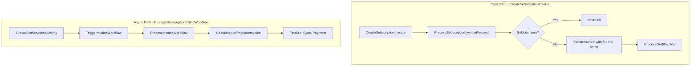
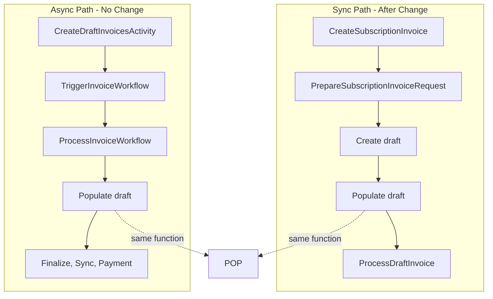

# Draft-First Invoice Generation Plan

## Current Flow (Two Divergent Paths)




**Key difference:** Sync path creates a full invoice in one shot via `CreateInvoice`. Async path creates drafts first, then populates via `CalculateAndPopulateInvoice`. The populate logic is duplicated (credits, coupons, taxes, invoice number, due date, etc.).

---

## Target Flow (Draft-First, Single Populate Path)




Both paths: **create draft → populate draft**. Single populate implementation.

---

## Exact Changes by File

### 1. [internal/service/invoice.go](internal/service/invoice.go)

**1a. Add `CreateDraftInvoiceForSubscription` to InvoiceService**

Move or expose draft creation in invoice service so `CreateSubscriptionInvoice` can use it without depending on subscription service. Option: add `CreateDraftInvoiceForSubscription(ctx, subscriptionID, period)` to invoice service (invoice service has `SubRepo`, `InvoiceRepo`).

**1b. Refactor `CreateSubscriptionInvoice`** (lines 1857–1918)

**Current:**

```go
invoiceReq, err := billingService.PrepareSubscriptionInvoiceRequest(...)
if invoiceReq.Subtotal.IsZero() { return nil, subscription, nil }
inv, err := s.CreateInvoice(ctx, *invoiceReq)
ProcessDraftInvoice(ctx, inv.ID, ...)
```

**New (draft-first):**

```go
invoiceReq, err := billingService.PrepareSubscriptionInvoiceRequest(...)
// Create draft first (idempotent; returns existing if same period)
draft, err := s.CreateDraftInvoiceForSubscription(ctx, req.SubscriptionID, dto.Period{Start: req.PeriodStart, End: req.PeriodEnd})
if err != nil { return nil, nil, err }
// Populate (handles zero by SkipInvoice)
skipped, err := s.CalculateAndPopulateInvoice(ctx, draft.ID)
if err != nil { return nil, nil, err }
if skipped { return nil, subscription, nil }
ProcessDraftInvoice(ctx, draft.ID, paymentParams, subscription, flowType)
return draft, subscription, nil  // Return fresh fetch if needed for final state
```

Note: `CalculateAndPopulateInvoice` returns `(skipped bool, err error)`. When skipped, we return `(nil, subscription, nil)` to match current behavior. When not skipped, we call `ProcessDraftInvoice` and return the invoice.

**1c. `CalculateAndPopulateInvoice`** (lines 732–926)

Keep as-is; it already implements the single populate path with `GetForUpdate`. Only its caller changes (CreateSubscriptionInvoice will call it after creating the draft).

**1d. Implement `CreateDraftInvoiceForSubscription` in invoice service**

Implement same logic as in [internal/service/subscription.go](internal/service/subscription.go) (lines 5765–5826):

- `ExistsForPeriod(subscriptionID, period.Start, period.End)`
- If exists: `List` by subscription+period, return existing (DRAFT or FINALIZED)
- Else: `SubRepo.Get(subscriptionID)`, build minimal `CreateInvoiceRequest` (zero amounts, `SkipInvoiceNumber: true`, `SuppressWebhook: true`), call `CreateInvoice(ctx, invoiceReq)`

---

### 2. [internal/service/subscription.go](internal/service/subscription.go)

**2a. Change `CreateDraftInvoiceForSubscription`** (lines 5765–5826)

Delegate to invoice service:

```go
func (s *subscriptionService) CreateDraftInvoiceForSubscription(ctx context.Context, subscriptionID string, period dto.Period) (*dto.InvoiceResponse, error) {
    invoiceService := NewInvoiceService(s.ServiceParams)
    return invoiceService.CreateDraftInvoiceForSubscription(ctx, subscriptionID, period)
}
```

This keeps the interface (`CreateDraftInvoiceForSubscription` on subscription service) and implementation in invoice service.

**2b. Add `CreateDraftInvoiceForSubscription` to InvoiceService interface**

In [internal/service/invoice.go](internal/service/invoice.go) interface and [internal/interfaces/service.go](internal/interfaces/service.go) if used there.

---

### 3. [internal/interfaces/service.go](internal/interfaces/service.go)

`CreateDraftInvoiceForSubscription` is on subscription service interface. After delegation, subscription service still exposes it; invoice service gains an internal method. No change to interfaces unless we want invoice service to expose it (e.g. for BillingActivities).

---

### 4. [internal/temporal/activities/subscription/update_billing_period_activities.go](internal/temporal/activities/subscription/update_billing_period_activities.go)

**Option A:** Keep calling `subscriptionService.CreateDraftInvoiceForSubscription` (line 115). Subscription delegates to invoice. No change.

**Option B:** Call `invoiceService.CreateDraftInvoiceForSubscription` directly if we move the interface to invoice service. Requires BillingActivities to have invoice service.

Recommendation: Option A to minimize changes.

---

### 5. [internal/repository/ent/invoice.go](internal/repository/ent/invoice.go)

**Fix `Update` to persist `InvoiceNumber`** (lines 456–483)

Add:

```go
.SetNillableInvoiceNumber(inv.InvoiceNumber)
```

Today, `CalculateAndPopulateInvoice` sets `inv.InvoiceNumber` but `Update` does not persist it.

---

## Return Value Handling

`CreateSubscriptionInvoice` currently returns `(*dto.InvoiceResponse, *subscription.Subscription, error)`.

- Before: when non-zero, it returned the created invoice.
- After: we create draft, populate, then ProcessDraftInvoice. We must return the populated invoice.

`CalculateAndPopulateInvoice` returns `(skipped bool, error)`. It does not return the invoice. Options:

1. **Fetch after populate:** `s.InvoiceRepo.Get(ctx, draft.ID)` before returning.
2. **Change `CalculateAndPopulateInvoice`** to return `(*dto.InvoiceResponse, skipped bool, error)` when not skipped.

Simplest: after `CalculateAndPopulateInvoice` returns `(false, nil)`, fetch the invoice: `inv, _ := s.InvoiceRepo.Get(ctx, draft.ID)` and return `(dto.NewInvoiceResponse(inv), subscription, nil)`. `ProcessDraftInvoice` uses `draft.ID`, so we only need the right invoice for the response.

---

## Zero-Usage Behavior

**Current:** `CreateSubscriptionInvoice` returns `(nil, subscription, nil)` for zero usage (no invoice created).

**After (draft-first):** We always create a draft. For zero usage, `CalculateAndPopulateInvoice` calls `SkipInvoice` and returns `(true, nil)`. We treat that as “no invoice to process” and return `(nil, subscription, nil)`. A SKIPPED invoice exists in the DB (matches async path).

---

## Call Graph After Refactor


| Caller                          | Flow                                                                                                                                       |
| ------------------------------- | ------------------------------------------------------------------------------------------------------------------------------------------ |
| **CreateSubscriptionInvoice**   | PrepareSubscriptionInvoiceRequest → CreateDraftInvoiceForSubscription → CalculateAndPopulateInvoice → (if not skipped) ProcessDraftInvoice |
| **ProcessInvoiceWorkflow**      | CalculateInvoiceActivity (CalculateAndPopulateInvoice) → FinalizeInvoiceActivity → Sync → Payment                                          |
| **CreateDraftInvoicesActivity** | CreateDraftInvoiceForSubscription (per period) — no change                                                                                 |
| **CreateInvoice**               | Still used for one-off, credit, and draft creation (CreateDraftInvoiceForSubscription calls it with minimal req)                           |


---

## Summary of File Changes


| File                                                                     | Change                                                                                                                                       |
| ------------------------------------------------------------------------ | -------------------------------------------------------------------------------------------------------------------------------------------- |
| [internal/service/invoice.go](internal/service/invoice.go)               | Add `CreateDraftInvoiceForSubscription`; refactor `CreateSubscriptionInvoice` to draft-first (create draft → populate → ProcessDraftInvoice) |
| [internal/service/subscription.go](internal/service/subscription.go)     | Delegate `CreateDraftInvoiceForSubscription` to invoice service                                                                              |
| [internal/repository/ent/invoice.go](internal/repository/ent/invoice.go) | Add `SetNillableInvoiceNumber` to `Update`                                                                                                   |


---

## Testing

- `TestCreateSubscriptionInvoice`, `TestCreateSubscriptionInvoiceWithInvoicingCustomerID`, `TestCreateSubscriptionInvoiceWithoutInvoicingCustomerID` — should pass
- `TestCalculateAndPopulateInvoice` (if present) — should pass
- ProcessSubscriptionBillingWorkflow integration — no change, should pass
- `invoice_void_recalculate_test` — uses CreateSubscriptionInvoice; verify behavior

---

## Migration / Backward Compatibility

No schema changes. Behavior:

- Sync path: always creates draft first, then populates (or skips). Same external result.
- Async path: unchanged.
- Zero-usage sync: now creates and skips a draft (SKIPPED invoice in DB); callers still get `nil` invoice.

